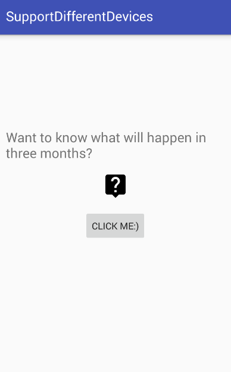
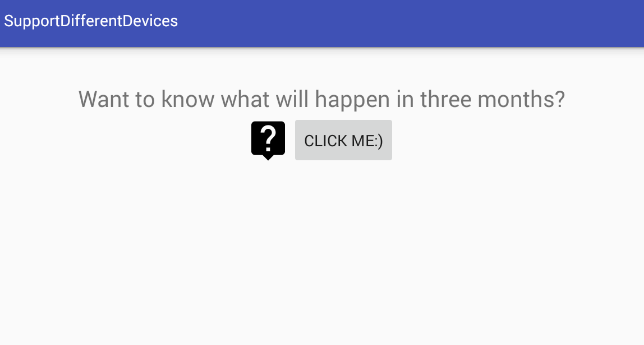
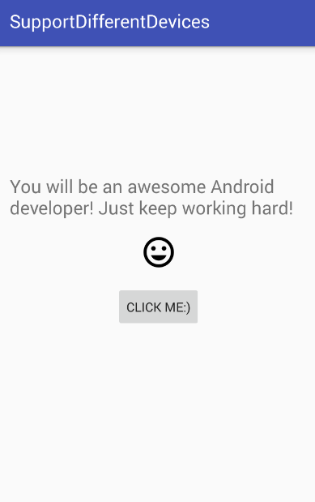
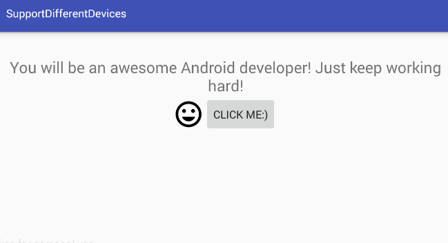

#   Designing for Multiple Devices

## Introduction  
The lab is focused on getting you to practice creating apps to support different SDKs, languages, layouts, and dimensions. It is an independent activity, but if you get stuck, ask the person sitting next to you for a hint or the instructor to help you.

## Exercise  

#### Requirements  

- minSdkVersion - Jelly Bean
- targetSdkVersion - Marshmallow
- English, French and Spanish languages to be supported
- portrait and landscape orientation to be supported
- absence of hardcoded strings, MainActivity and xml layout files should have reference to the string.xml file
- icons to be generated through Android Vector Asset Studio of the size 40dpx40dp
- textSize of the TextView to be 20sp and stored in dimens.xml rather than a hardcoded value  

#### Bonus  
- create a separate layout file to support tablet size devices

## Deliverable

The app should eventually look like:

        

When the button is clicked the icon and text should change:

           

## Resources:
- [Take a look at the lesson notes](https://github.com/generalassembly-studio/ADI-curriculum/tree/designing-for-multiple-devices-lesson/resources/07-android-technologies-and-services/designing-for-multiple-devices)
